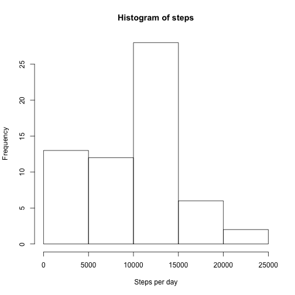
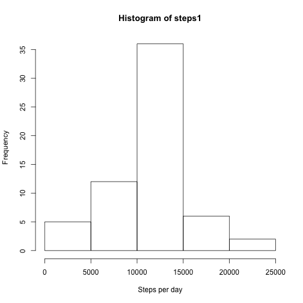
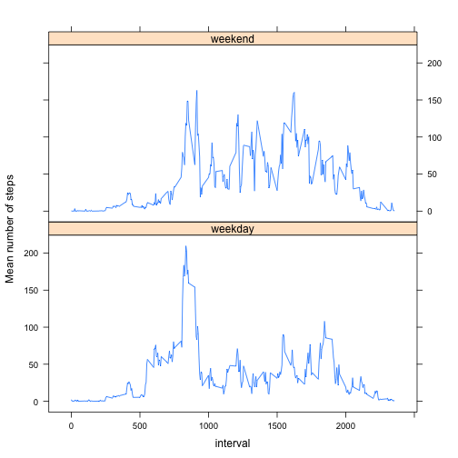

Activities project
==================
## Description of the project

This assignment makes use of data from a personal activity monitoring device.
This device collects data at 5 minute intervals through out the day.
The data consists of two months of data from an anonymous individual
collected during the months of October and November, 2012 and include the
number of steps taken in 5 minute intervals each day.

The variables included in the dataset are:
- steps: Number of steps in a 5-minute intervals (missing values are coded
as 𝙽𝙰)
- date: The date on which the measurement was taken in YYYY-MM-DD format
- interval: Identifier for the 5-minute interval in which measurement was
taken

## Loading of the data

The project requires that the file "activity.csv" has been downloaded to the
working folder. The *url* had to be modified to load it into R. "https://"
was converted into "http://"

```r
# Download and load data
url = "http://d396qusza40orc.cloudfront.net/repdata%2Fdata%2Factivity.zip"
file = "activity.csv"
if (!file.exists(file)){
    download.file(url,file)
}
if (!exists("rawdata")){
    rawdata <- read.csv(file)
}
```
## Formatting of the data
The date and the time interval are converted to a date-time format.

```r
hours <- floor(seq(1,288)/12)
minutes <- c(seq(5,55,5),rep(seq(0,55,5),23),0)
times <- strptime(paste0(hours,":",minutes),format="%H:%M")
```

## Steps taken per day

The total number of steps taken per day is calculated as

```r
steps <- with(rawdata,tapply(steps,date,sum, na.rm=TRUE))
```
and it is plotted in a histogram

```r
hist(steps,xlab="Steps per day")
```



The mean of the step number per day is 9354.2295082 and the median of the the
daily step number is 10395.

## Average daily activity pattern

The time series plot of the 5 minute interval and the average number of steps
taken, averaged across all days

```r
meanbyinterval <- with(rawdata,tapply(steps,interval,mean,na.rm=TRUE))
intervals <- unique(rawdata$interval)
plot(times,meanbyinterval[,2],type="l",xlab="Time interval (HH:MM)",
        ylab="Mean number of steps")
```

```
## Error in meanbyinterval[, 2]: número incorreto de dimensiones
```

The times are recalculated as strings

```r
times2 <- paste0(hours,":",minutes)
```
The interval with the maximum number of steps across all the days can
be given. Starts at

```r
times2[which.max(meanbyinterval)]
```

```
## [1] "8:40"
```
and finishes at

```r
times2[which.max(meanbyinterval)+1]
```

```
## [1] "8:45"
```

## Imputing missing values

The total number of entries (rows) showing missing values is calculated
checking that at least one element of the row is missing

```r
nas <- is.na(rawdata)
nas <- nas[,1]|nas[,2]|nas[,3]
table(nas)[2]
```

```
## TRUE 
## 2304
```
The imputing of the missing values will be done using the mean value of the
corresponding interval. First the raw data is copied to a new data frame.

```r
imputed <- rawdata
```
Then, the missing values are taken from the mean by interval previously
calculated.

```r
meanbyinterval <- as.data.frame.table(meanbyinterval)
imputed[nas,1] <- meanbyinterval[meanbyinterval[1,]==rawdata[nas,3],2]
```

The total number of steps taken per day is recalculated after imputing the
data.

```r
steps1 <- with(imputed,tapply(steps,date,sum, na.rm=TRUE))
```
and the histogram is replotted

```r
hist(steps1,xlab="Steps per day")
```



Now, the mean of the step number per day is 1.0757261 &times; 10<sup>4</sup> instead of
9354.2295082 and the median of the daily step number is 1.0698113 &times; 10<sup>4</sup>,
instead of 10395. Both values are larger after imputing the missing
values, because missing values have been counted as zero for the mean and the
median.

## Differences between weekdays and weekends

Define a function to separate the weekdays into weekday and weekend.

```r
daytype <- function(x){
    char="NA"
    if (x=="Monday") {char = "weekday"}
    else if (x=="Tuesday") {char = "weekday"}
    else if (x=="Wednesday") {char = "weekday"}
    else if (x=="Thursday") {char = "weekday"}
    else if (x=="Friday") {char = "weekday"}
    else if (x=="Saturday") {char = "weekend"}
    else if (x=="Sunday") {char = "weekend"}
    return(char)
}
```
This function is used to define each day as weekday or weekend and add the
value to the imputed data as a new factor variable.

```r
dayofweek <- weekdays(imputed$datetime)
imputed$daytype <- as.factor(sapply(dayofweek,FUN=daytype))
```
The mean by interval and day type is calculated. The data is melted to plot
it easier with the lattice system

```r
meanbyinterval2 <- with(imputed,tapply(steps,list(interval,daytype),mean))
meanbyinterval2 <- melt(meanbyinterval2,id=c("weekday","weekend"))
names(meanbyinterval2) <- c("interval", "weekdays", "value")
```
The time series is plotted splitted into the weekdays and the weekend

```r
library(lattice)
xyplot(value ~ interval | weekdays, data = meanbyinterval2,layout=c(1,2),
        type = "l", ylab = "Mean number of steps")
```


